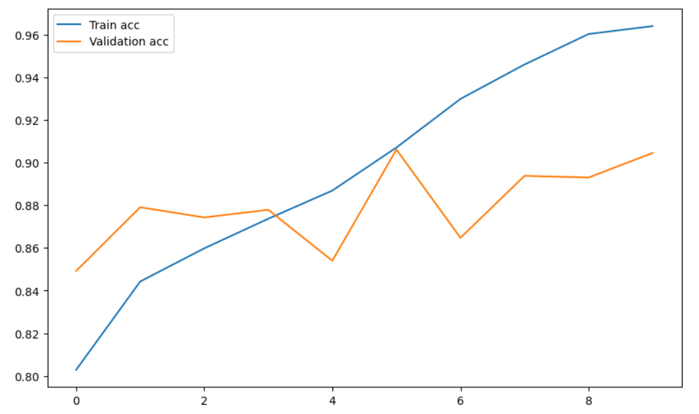
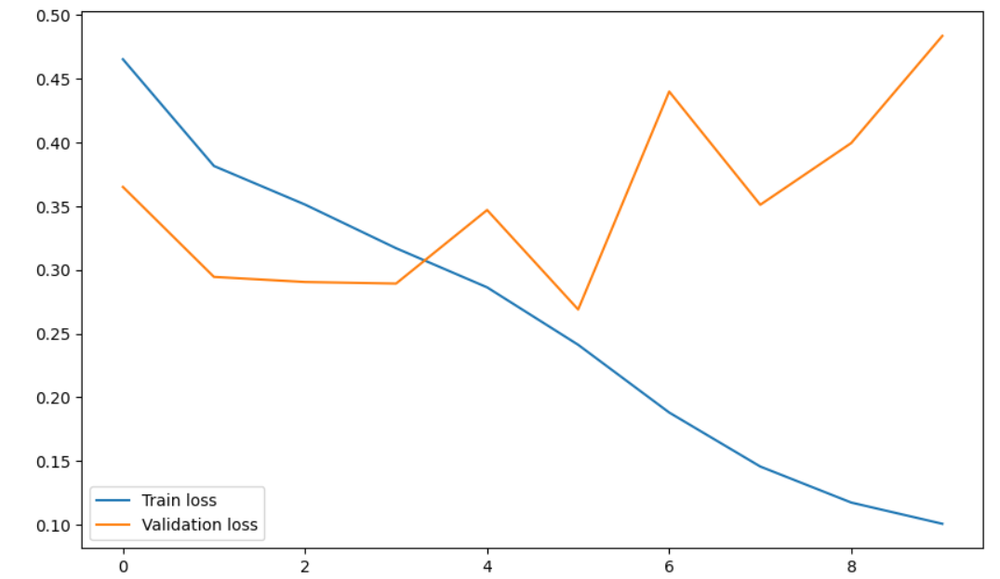

# Waste Classification using CNN

## Overview
This project aims to develop a Convolutional Neural Network (CNN) model to classify images of plastic waste into different categories. The dataset used for training and validation is sourced from [Kaggle](https://www.kaggle.com/datasets/techsash/waste-classification-data/data).

## Dataset
The dataset consists of images of various types of waste, categorized accordingly. It helps in automating waste classification, which is essential for efficient recycling and waste management.

## Model Architecture
The CNN model follows a deep learning-based approach and consists of multiple convolutional layers, pooling layers, and fully connected layers to achieve accurate classification. The model is trained using TensorFlow and Keras.

## Installation
To run this project, ensure you have the following dependencies installed:

```bash
pip install tensorflow keras numpy matplotlib pandas
```

## Training Process
- The dataset is split into training and validation sets.
- The CNN model is trained using cross-entropy loss and Adam optimizer.
- Data augmentation techniques are applied to improve model generalization.

## Performance Metrics
Below are the accuracy and loss graphs obtained from training the model:

### Accuracy Graph


### Loss Graph


## Usage
To train and test the model, run the provided Jupyter Notebook:

```bash
jupyter notebook WasteClassification_MKR.ipynb
```

## Results
The trained model achieves significant accuracy in classifying different types of plastic waste. Further improvements can be made by fine-tuning hyperparameters and using transfer learning techniques.

## Contribution
Feel free to contribute to this project by improving the model or adding new datasets. You can fork this repository and submit a pull request.

